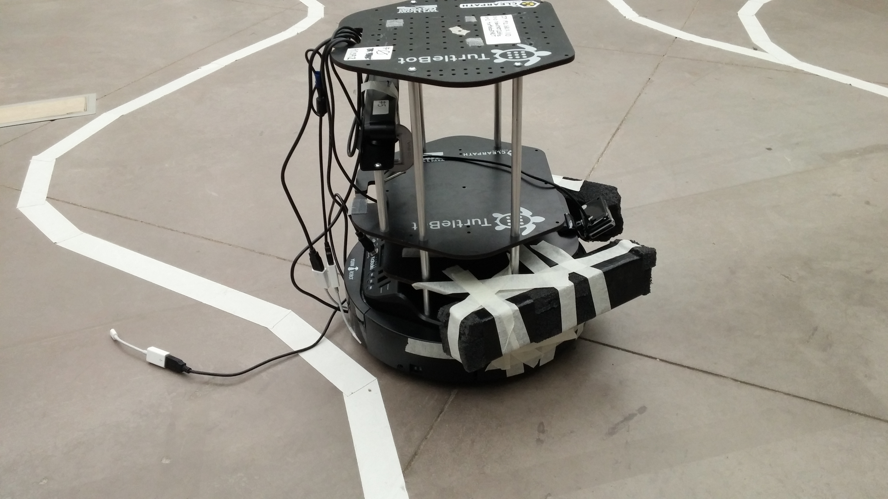
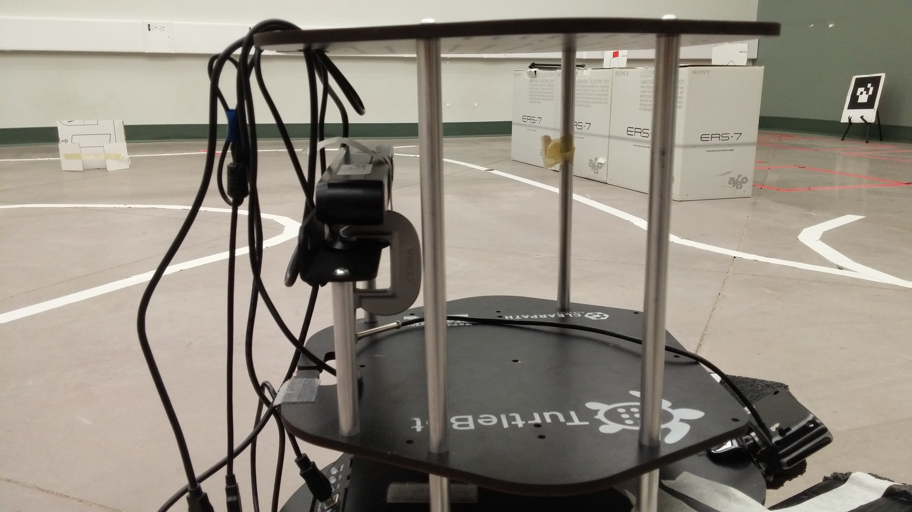
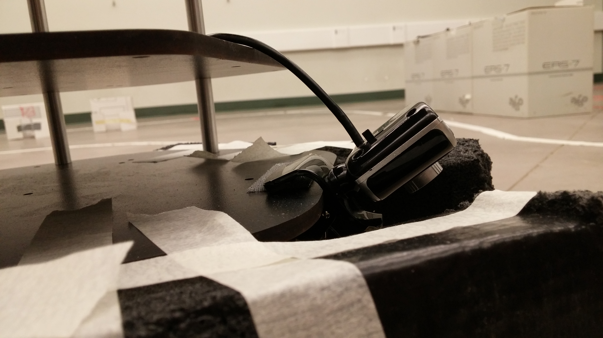
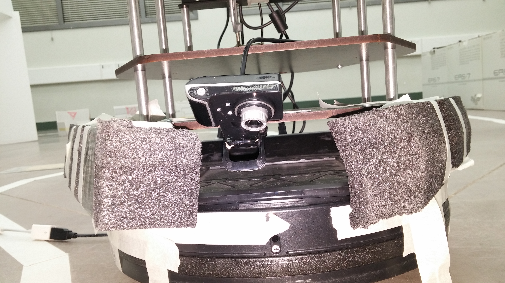
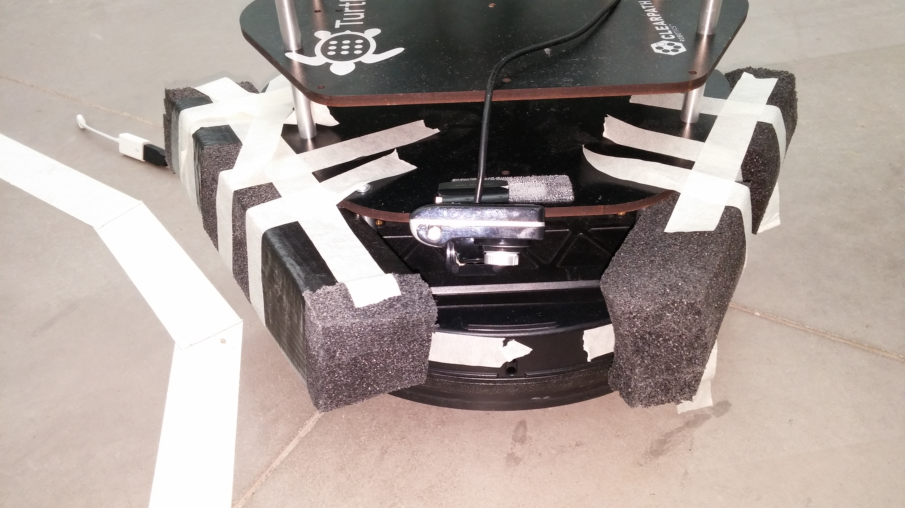

# Competition 5

This repository contains our code for the fifth competition of [CMPUT 412, Experimental Mobile Robotics](https://www.ualberta.ca/computing-science/undergraduate-studies/course-directory/courses/experimental-mobile-robotics).
The challenges in this competition are identical to the previous competition, [competition 4](https://github.com/CMPUT412-2019/competition4), our solution to which builds on our solutions to competitions [3](https://github.com/cmput412-2019/competition3) and [2](https://github.com/cmput412-2019/cmput412-competition2).

As [described previously](https://github.com/CMPUT412-2019/competition4#purpose), the competition consists of a course on which the robot must demonstrate various tasks, such as line following, shape detection, and AR tag detection.
This competition differs only in the scoring: multiple runs around the track are allowed, and points are cumulative in all runs.
The point amounts are also re-balanced to favour box-pushing.
For details on the individual tasks, see [our previous report](https://github.com/CMPUT412-2019/competition4#competition-overview).

# Setup and building

The project requires ROS Kinetic with the turtlebot, openni, ar_track_alvar, usb_cam, amcl and gmapping packages. Additionally, gTTs is required to generate the sounds.

    pip install gTTS

The robot is setup as the following, with an RGB-D camera facing forward and a webcam on the bottom front, looking down:

| Robot setup | RGB-D camera | Bottom camera
:-:|:-:|:-:
 |  | 

Two blocks of styrofoam are taped to either side of the robot in order to aid box-pushing while not blocking the view of the bottom camera:

| Styrofoam setup (front view) | Styrofoam setup (top view)
:-:|:-:
 | 

The code should be procured by cloning this repository. To build the components ROS needs to run the code, use

    cd competition5
    catkin build
    source devel/setup.bash

Then, generate the sound files

    cd util/sound
    python gen.py
    cd -

Finally, obtain `fastai_trained.onnx` from the releases of this repository and copy it to `src/feature_detector/scripts/server`.

# Running the code

Plug the Kobuki base, both cameras and a joystick into your laptop. Then run the launch file

    roslaunch competition4 competition4.launch

and run the python file `src/competition4/scripts/competition4.py`.

# Method

## Re-used components

We re-used the following components from previous competitions:

- [Changing state at red lines](https://github.com/CMPUT412-2019/cmput412-competition2#changing-state-at-red-lines)
- [Turning](https://github.com/CMPUT412-2019/cmput412-competition2#turning)
- [Stopping](https://github.com/CMPUT412-2019/cmput412-competition2#stopping)
- [Waypoint navigation](https://github.com/CMPUT412-2019/competition3/blob/master/Readme.md#waypoint-navigation)
- [Off-ramp and on-ramp](https://github.com/CMPUT412-2019/competition3/blob/master/Readme.md#off-ramp-and-on-ramp)
- [Searching for AR cube and target marker](https://github.com/CMPUT412-2019/competition4#searching-for-ar-cube-and-target-marker)
- [Shape detection (locations 2 and 3)](https://github.com/CMPUT412-2019/competition4#shape-detection-locations-2-and-3)

## Line-following

While line-following is conceptually similar to [previous competitions](https://github.com/CMPUT412-2019/cmput412-competition2#line-following), we made several small changes to the algorithm:

- The white mask has been updated to be more sensitive than before, to prevent the robot from immediately losing the line after location 1. It also uses the HSL colour space rather than HSV.
- To remove false positives, the line is only considered to be seen if there are more than 100 pixels matching the line colour.
- If the line is lost, the robot considers its location in pixel coordinates to be identical to its last known location.
- The robot does not move at constant speed, but rather slows down as the center of mass of the line pixels moves away from the center of the camera (this was present in earlier competitions, but appears to be unmentioned in their reports).
