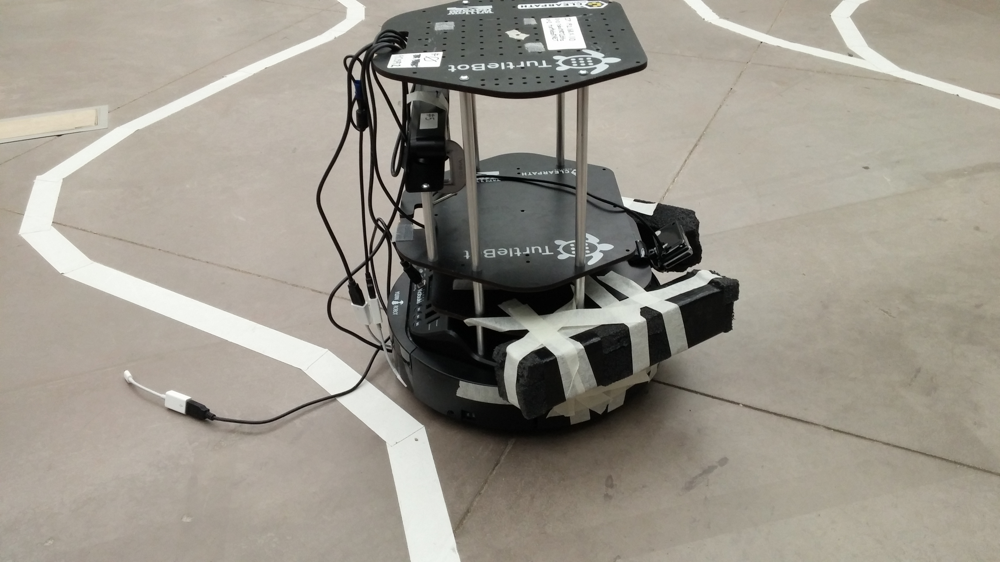
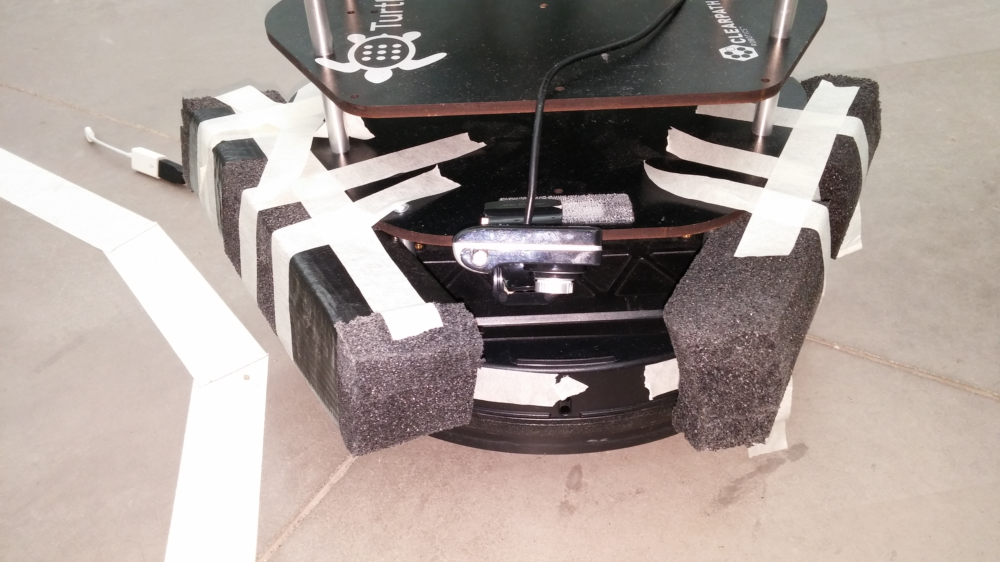
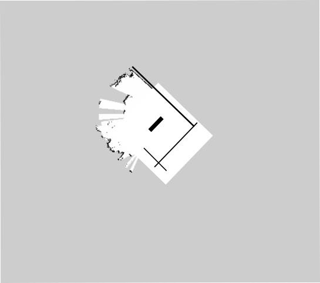

# Competition 5

This repository contains our code for the fifth competition of [CMPUT 412, Experimental Mobile Robotics](https://www.ualberta.ca/computing-science/undergraduate-studies/course-directory/courses/experimental-mobile-robotics).
The challenges in this competition are identical to the previous competition, [competition 4](https://github.com/CMPUT412-2019/competition4), our solution to which builds on our solutions to competitions [3](https://github.com/cmput412-2019/competition3) and [2](https://github.com/cmput412-2019/cmput412-competition2).

As [described previously](https://github.com/CMPUT412-2019/competition4#purpose), the competition consists of a course on which the robot must demonstrate various tasks, such as line following, shape detection, and AR tag detection.
This competition differs only in the scoring: multiple runs around the track are allowed, and points are cumulative in all runs.
The point amounts are also re-balanced to favour box-pushing.
For details on the individual tasks, see [our previous report](https://github.com/CMPUT412-2019/competition4#competition-overview).

# Setup and building

Installation instructions are largely identical to those of [competition 4](https://github.com/CMPUT412-2019/competition4#setup-and-building), except that

- The code should be procured by cloning this repository, instead of the competition 4 repository (the trained model should still be obtained from the competition 4 release)
- The map from the competition 3 release is no longer needed
- The box-pushing and camera apparatus has changed, and now is as follows:
  
  

# Running the code

The code is run exactly [as before](https://github.com/CMPUT412-2019/competition4#running-the-code).

# Method

## Re-used components

We re-used the following components from previous competitions:

- [Changing state at red lines](https://github.com/CMPUT412-2019/cmput412-competition2#changing-state-at-red-lines)
- [Turning](https://github.com/CMPUT412-2019/cmput412-competition2#turning)
- [Stopping](https://github.com/CMPUT412-2019/cmput412-competition2#stopping)
- [Waypoint navigation](https://github.com/CMPUT412-2019/competition3/blob/master/Readme.md#waypoint-navigation)
- [Off-ramp and on-ramp](https://github.com/CMPUT412-2019/competition3/blob/master/Readme.md#off-ramp-and-on-ramp)
- [Searching for AR cube and target marker](https://github.com/CMPUT412-2019/competition4#searching-for-ar-cube-and-target-marker)
- [Shape detection (locations 2 and 3)](https://github.com/CMPUT412-2019/competition4#shape-detection-locations-2-and-3)

## Line-following

While line-following is conceptually similar to [previous competitions](https://github.com/CMPUT412-2019/cmput412-competition2#line-following), we made several small changes to the algorithm:

- The white mask has been updated to be more sensitive than before, to prevent the robot from immediately losing the line after location 1. It also uses the HSL colour space rather than HSV.
- To remove false positives, the line is only considered to be seen if there are more than 100 pixels matching the line colour.
- If the line is lost, the robot considers its location in pixel coordinates to be identical to its last known location.
- The robot does not move at constant speed, but rather slows down as the center of mass of the line pixels moves away from the center of the camera (this was present in earlier competitions, but appears to be unmentioned in their reports).

## Mapping and localization

We now use [GMapping](https://openslam-org.github.io/gmapping.html) for mapping and [AMCL](https://wiki.ros.org/amcl?distro=kinetic) for localization.
The map is limited to the location 4 area only.
We scattered objects around that area randomly when mapping in order to give GMapping more features and improve map quality.
We then manually cleaned up the map, including removing these objects.
The final map is shown below:

We manually set the robot's position within the map when the robot stops at the stop line just before the off ramp.
